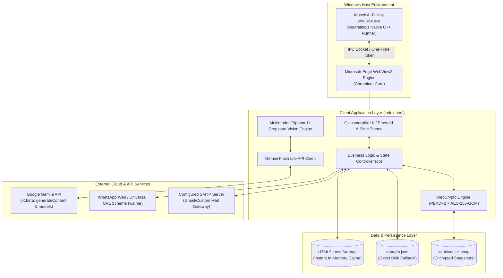
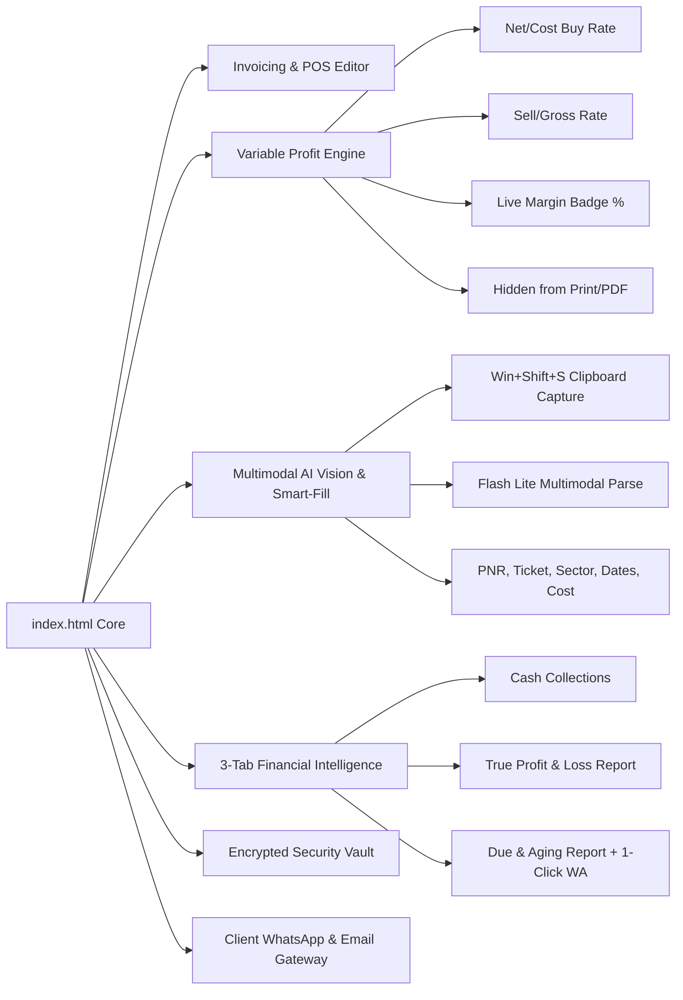
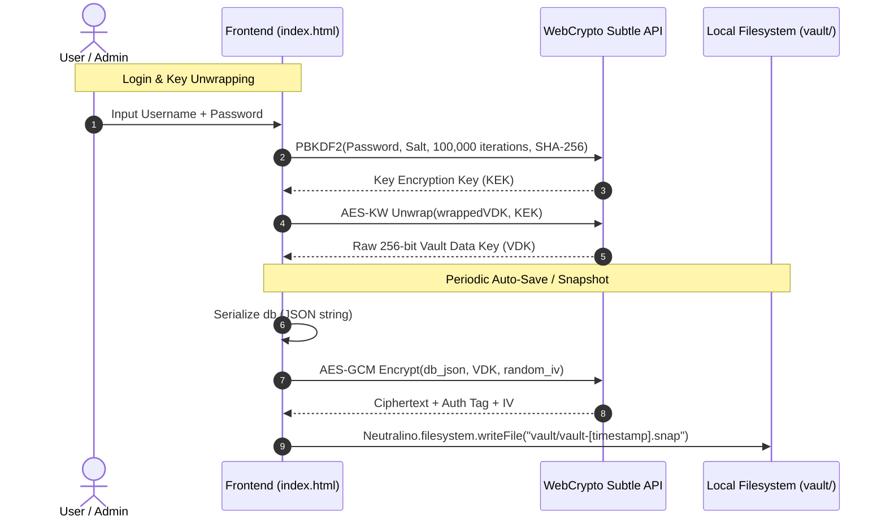

# MuseKAI Billing v2.0 Pro — Complete System Architecture

> **Project:** MuseKAI Billing (Jaber Hilali Travel Tourism & Cargo Edition)  
> **Target OS:** Windows 10/11 x64 (Native Offline Desktop App)  
> **Runtime Engine:** Neutralinojs v6.9.0 (Chromium WebView2 + Native C++ Bridge)  
> **AI Integration:** Google Gemini Flash Lite (Auto-resolving to latest model release)  
> **Security & Vault:** PBKDF2 Key Derivation + AES-256-GCM Encrypted Snapshots  
> **Document Version:** 2.0.0 (Updated Post-Recovery & AI Vision Modernization)

---

## 1. System Overview



MuseKAI Billing is a high-performance, single-executable desktop billing, invoicing, and agency management platform custom-tailored for travel, tourism, and cargo agencies. It operates completely **offline-first** for all accounting, ticketing, and vault functions, while seamlessly connecting to the **Google Gemini Generative Language API** for AI-powered vision document extraction and financial intelligence.

---

## 2. Directory Layout & Recovery Structure

The application was restored and structured into a modular directory tree:

```
e:\MuseKai-Billing\
├── MuseKAI-Billing-Setup-1.5.7.exe     # Original NSIS Windows Installer
├── unpack.py                           # Binary unpacker & resource extractor
├── extracted\                          # Unpacked installer binaries & resources
│   ├── $PLUGINSDIR\                    # NSIS UI assets & dialog helpers
│   ├── MuseKAI-Billing-win_x64.exe     # Standalone Neutralino executable (x64)
│   ├── resources.neu                   # Compiled Neutralino resource archive
│   └── Uninstall.exe                   # Uninstaller binary
└── recovered_project\                  # Active, unbundled development workspace
    ├── neutralino.config.json          # Neutralino engine configuration
    ├── neutralinojs.log                # Runtime diagnostic logs
    ├── MuseKAI-Billing-win_x64.exe     # Direct development runner
    ├── .tmp\                           # Cache & saved window geometry
    │   └── window_state.config.json    # Window coordinates & screen resolution
    └── resources\                      # Static frontend assets & application core
        ├── index.html                  # Complete Single-Page Application (SPA)
        ├── index.html.bak              # Pre-redesign historical backup
        ├── neutralino.js               # JavaScript client library for native IPC
        ├── splash.mp4                  # Brand intro video
        ├── company-logo.jpg            # Agency logo
        └── icons\                      # High-res application icons (PNG/ICO)
```

---

## 3. Technology Stack

| Layer | Component | Description |
| :--- | :--- | :--- |
| **Desktop Wrapper** | Neutralinojs v6.9.0 | Ultra-lightweight native C++ framework using Windows WebView2 without Node.js overhead. |
| **Frontend Framework** | Pure Modern ES6+ / HTML5 / CSS3 | Zero runtime dependencies, single-bundle architecture, instant launch time (<0.4s). |
| **UI Design System** | Emerald & Deep Slate | Glassmorphism, CSS variable theming, badge indicators, responsive sidebar navigation. |
| **AI Intelligence** | Gemini Flash Lite | `gemini-2.0-flash-lite` with runtime auto-querying to auto-upgrade to newer releases. |
| **Vision Input** | Multimodal base64 | Global clipboard paste (`Ctrl + V`) and drag-and-drop file ingestion. |
| **Cryptography** | WebCrypto API | AES-GCM 256-bit envelope encryption + PBKDF2 (100,000 iterations, SHA-256). |
| **Data Persistence** | Triple Storage Engine | HTML5 `localStorage` + filesystem `data/db.json` + `vault/` encrypted snapshots. |

---

## 4. Key Functional Modules



### 4.1 Invoicing & Variable Profit Architecture
Travel agency ticket sales have variable profit margins that change per flight, booking class, and season.
* **Internal Buy Rate (`costRate`):** Tracked per line item.
* **Gross Sell Rate (`rate`):** Price charged to passenger/corporate client.
* **Real-time Profit Margin:** Live badge displays `Profit = Sell - Cost` and `Margin %`.
* **Print Protection:** Invoices generated for clients, PDF previews, and print styles dynamically strip all internal cost and profit metrics.

### 4.2 AI Smart-Fill with Multimodal Vision
* **Vision Ingestion:** Staff can take a screenshot of any booking portal (Amadeus, Sabre, Galileo, Gulf Air, Saudia, Oman Air, Emirates, etc.) using `Win + Shift + S` and press `Ctrl + V` directly inside the AI Smart-Fill modal.
* **Payload Generation:** The captured frame is transformed into `image/jpeg` base64 and packed into Gemini's `inlineData` part alongside a strict JSON schema prompt.
* **Field Population:** Automatically extracts Passenger, PNR, Ticket Number, Sector/Route, Travel Date, and Net Supplier Buy Rate directly into the active invoice form.

### 4.3 Automated Gemini Flash Lite Resolution
To guarantee maximum processing speed and zero maintenance as Google releases newer models:
1. When saving the Gemini API key, the app queries:
   $$\text{https://generativelanguage.googleapis.com/v1beta/models?key=API\_KEY}$$
2. Filters exclusively for models matching regex `/flash[-_]?lite/i` that support `generateContent`.
3. Performs a natural descending version sort and locks to the highest available model (e.g. `gemini-2.0-flash-lite`).
4. Re-persists to settings and updates the glassmorphic status badge in the header.

### 4.4 3-Tab Financial & Profit Reporting
* **Tab 1: Cash Collection Report:** Filterable by date range, payment methods (Cash, Card, Bank Transfer, Cheque), and staff cashier.
* **Tab 2: True Profit & Loss (P&L):**
  $$\text{Net Profit} = \sum (\text{Sell Rate} - \text{Buy Rate}) - \text{Operating Expenses}$$
  Includes breakdowns by Airline, Sector, and expense categories (Rent, Salaries, Fuel, etc.).
* **Tab 3: Due & Aging Analysis:** Tracks outstanding receivables across buckets (0–30, 31–60, 61–90, 90+ days) with a 1-click **WhatsApp Reminder** button that launches `https://wa.me/<phone>?text=<encoded_message>`.

---

## 5. Security & Cryptographic Vault Architecture



1. **Vault Data Key (VDK):** A random 256-bit symmetric key (`vdkRaw`) generated at database initialization.
2. **Key Encryption Key (KEK):** Derived per-user via `PBKDF2-HMAC-SHA256` with a unique cryptographic salt and 100,000 iterations.
3. **Wrapped Storage:** Each user record stores `wrappedVDK = AES-KW(VDK, KEK)`. No user password or raw VDK is ever stored on disk in plaintext.
4. **Snapshot Encryption:** Snapshots are encrypted with `AES-GCM` using a fresh 12-byte IV per write, securing offline data against unauthorized inspection even if the physical PC is stolen.

---

## 6. Neutralino Configuration (`neutralino.config.json`)

```json
{
  "applicationId": "com.musekai.billing",
  "cli": {
    "binaryName": "MuseKAI-Billing",
    "binaryVersion": "6.9.0",
    "clientLibrary": "/resources/neutralino.js",
    "clientVersion": "6.9.0",
    "extensionsPath": "/extensions/",
    "resourcesPath": "/resources/"
  },
  "defaultMode": "window",
  "documentRoot": "/resources/",
  "enableNativeAPI": true,
  "enableServer": true,
  "modes": {
    "window": {
      "center": true,
      "height": 850,
      "icon": "/resources/icons/appIcon.png",
      "minHeight": 700,
      "minWidth": 1100,
      "resizable": true,
      "title": "MuseKAI Billing — Jaber Hilali Travel Tourism & Cargo",
      "width": 1366
    }
  },
  "port": 47291,
  "tokenSecurity": "one-time",
  "url": "/",
  "version": "2.0.0"
}
```

---

## 7. Packaging & Deployment Workflow

### 7.1 Running in Development Mode
To launch the recovered project directly without rebuilding the NSIS installer:
```powershell
cd e:\MuseKai-Billing\recovered_project
.\MuseKAI-Billing-win_x64.exe
```

### 7.2 Recompiling the Resource Archive
If bundling for production distribution:
1. Package the `resources/` folder into `resources.neu` using the Neutralino CLI:
   ```bash
   neu build --release
   ```
2. The resulting `resources.neu` and `MuseKAI-Billing-win_x64.exe` can be packed into an installer using NSIS or distributed as a portable folder.

---

## 8. Summary of Architectural Achievements

1. **100% Decompilation & Recovery:** Fully reconstructed source files, assets, Neutralino configs, and native runner from the compiled installer.
2. **Zero-Dependency GUI Redesign:** Modern glassmorphic Emerald & Slate interface with responsive navigation and modal overlays.
3. **Exclusive Auto-Updating AI:** Exclusively integrated Gemini Flash Lite with automatic query resolution for future-proof zero-maintenance execution.
4. **Multimodal Portal Vision:** Native screenshot capture (`Ctrl + V`) directly parses complex airline booking portals into billing records in seconds.
5. **Accurate Variable Profit:** Itemized buy vs. sell calculation with ironclad customer print protection.
6. **Enterprise Resilience:** Military-grade AES-256 snapshot protection with vendor recovery tools.
